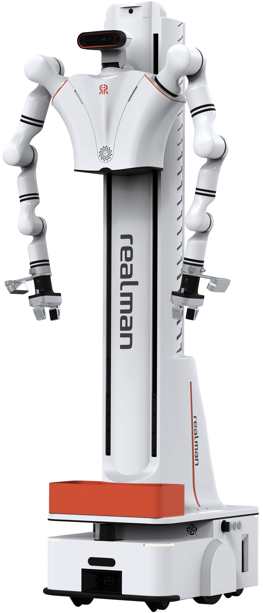
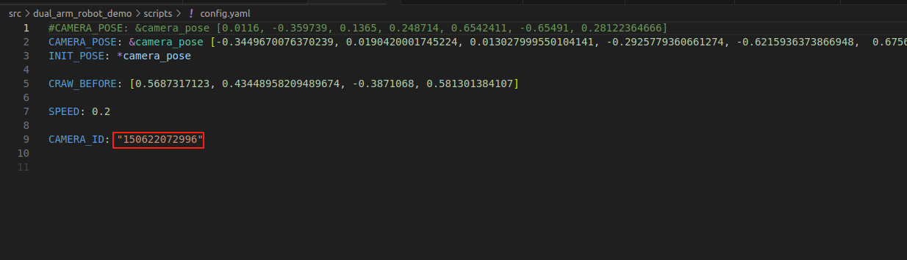
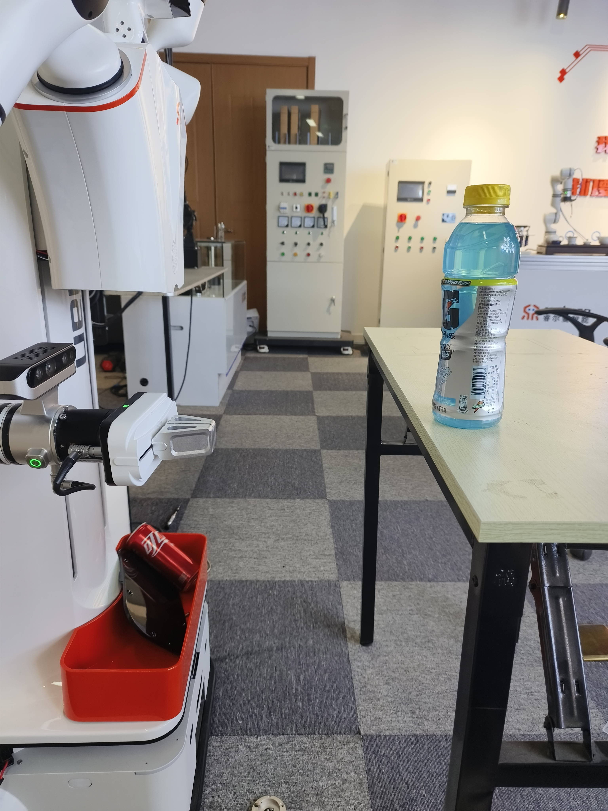
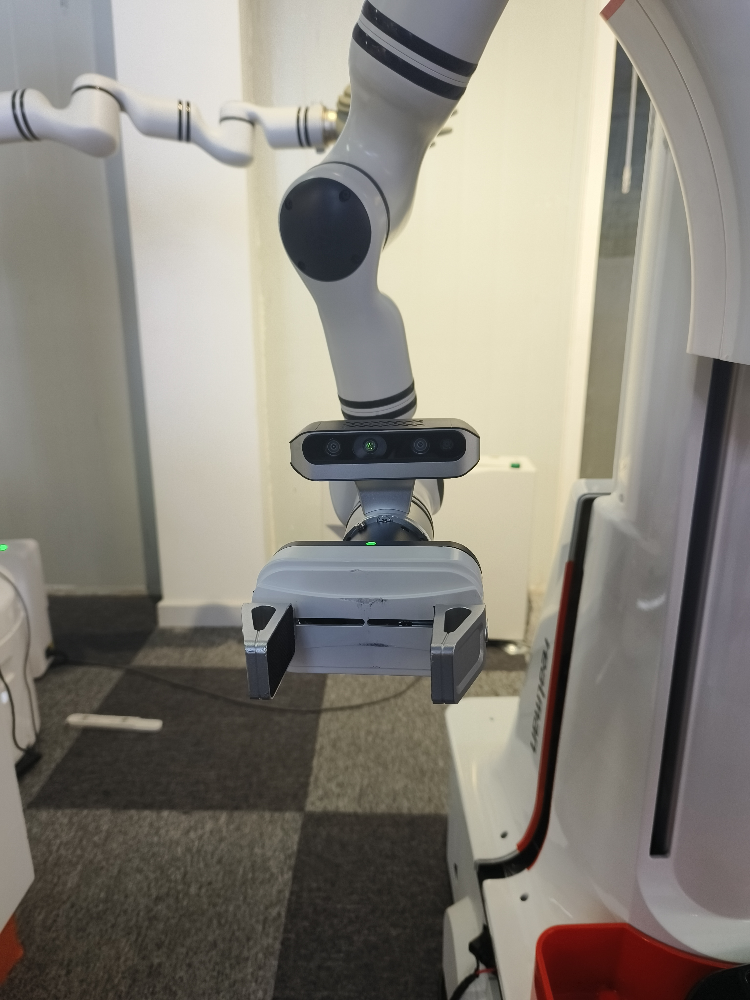
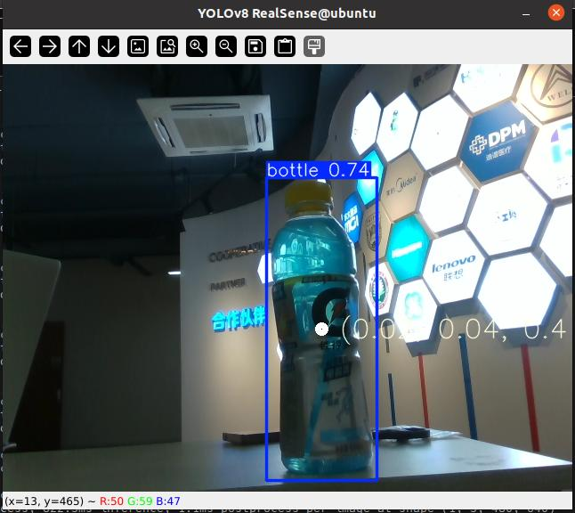
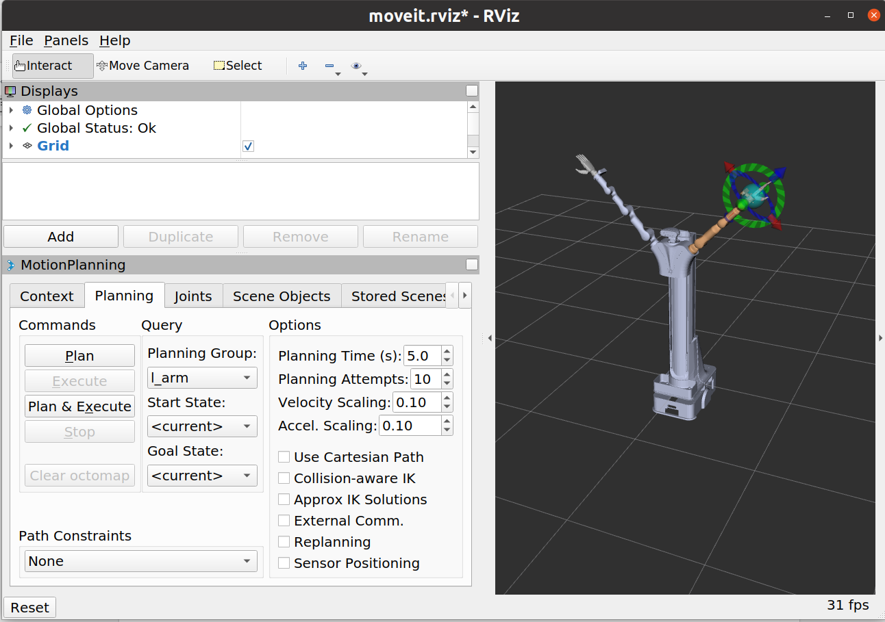

## **1. Project Introduction**

* Project Overview

  Develop and integrate a ROS package for a bipedal dual-arm robot, which includes mechanical arms, a mobile chassis, visual sensors, and a head servo control module.

* System Composition
  1. **Mechanical Arm Module**：With two 7/6-axis robotic arms, it has the ability of single-arm independent operation and dual-arm cooperative operation.
  2. **Mobile Chassis Module (`AGV`）**: Equipped with motion, navigation, and obstacle avoidance capabilities.
  3. **Visual Sensor Module (`D435`）**：`Intel RealSense D435`The camera provides depth images,`RGB`images, and depth values of specified pixels, supporting the robot in environmental perception, object recognition, and localization functions.
  4. **Head Servo Module**: By controlling the head servo, the robot can flexibly adjust its viewpoint, enhancing its ability to observe the environment.



​                                                                                                              Figure 1 Bipedal Dual-Arm Robot

* Code Version

  `V1.1.2`

* Hardware Environment

  | Component Name                                               | Hardware Version Information                                 | Software Version Information                                 |
  | ------------------------------------------------------------ | ------------------------------------------------------------ | ------------------------------------------------------------ |
  | Mechanical Arm                                               | RM75-B/RM65-B                                                | Controller V1.4.10 and above, API V4.2.8 and above, ROS Package V2.0.1 |
  | Camera                                                       | Realsense D435C                                              | realsense-ros-2.3.2                                          |
  | Main Control                                                 | jetson xavier NX                                             | ubuntu20.04 、ros-noetic                                     |
  | Chassis                                                      | wushi                                                        |                                                              |
  | Head Servo                                                   | LX-224HV 1                                                   | Serial Communication                                         |
  | End Effector (Optional)                                      | RMG24平行夹爪/EG2-4C2夹爪/灵巧手（右手RM56DFX-2R/左手RM56DFX-2L/傲翼™（OHand™） |                                                              |
  | For more information, refer to:<https://develop.realman-robotics.com/robot/versionComparisonTable.html> ROS Package Download:<https://github.com/RealManRobot> |                                                              |                                                              |

## 2. Environmental Requirements

* System:`Ubuntu `20.04

* ROS：`noetic`

## **3. Code Structure**

```

rmc_aida_l_ros1
├── 具身双臂机器人ROS1话题服务列表.md
├── Embodied dual-arm robot ROS1 topic service list.en.md
├── README_CN.md
├── README.md
└── src
    ├── agv_demo  调用悟时底盘ros接口样例包
    │   ├── 底盘说明文件
    │   │   ├── 底盘链接.txt
    │   │   ├── 移动机器人的ROS接口（对外） - WOOSH Robotics.pdf
    │   │   ├── Woosh Design用户指南.pdf
    │   │   ├── Woosh Design User Guide_ZH.pdf
    │   │   ├── Woosh Mobile交互软件用户指南.pdf
    │   │   ├── Woosh Mobile User Guide_ZH.pdf
    │   │   └── woosh_robot_sdk_interface_v1.1.62.pdf
    │   ├── CMakeLists.txt
    │   ├── include
    │   │   └── agv_demo
    │   ├── package.xml
    │   ├── README_AGV.md
    │   └── scripts
    │       └── agv_demo.py 样例代码
    ├── camera_demo 相机调用样例代码
    │   ├── d435_demo d435相机调用样例包
    │   │   ├── CMakeLists.txt
    │   │   ├── launch
    │   │   │   ├── d435_pub.launch
    │   │   │   └── d435_sub.launch
    │   │   ├── package.xml
    │   │   └── scripts
    │   │       ├── __init__.py
    │   │       ├── video_stream_pub.py
    │   │       └── video_stream_sub.py
    │   ├── README_D435.md  相机包调用命令文档
    │   └── usb_camera_demo usb相机调用样例包
    │       ├── CMakeLists.txt
    │       ├── config
    │       │   └── camera_params.yaml
    │       ├── include
    │       │   └── usb_camera
    │       ├── launch
    │       │   ├── usb_camera_pub.launch
    │       │   └── usb_camera_sub.launch
    │       ├── package.xml
    │       ├── scripts
    │       │   ├── video_stream_pub.py
    │       │   └── video_stream_sub.py
    │       └── src
    ├── dual_arm_control 双臂包
    │   ├── arm_control
    │   │   ├── CMakeLists.txt
    │   │   ├── package.xml
    │   │   └── src
    │   │       ├── arm_control.cpp
    │   │       └── cubicSpline.h
    │   ├── arm_driver
    │   │   ├── CMakeLists.txt
    │   │   ├── launch
    │   │   │   ├── dual_arm_65_driver.launch
    │   │   │   └── dual_arm_75_driver.launch
    │   │   ├── package.xml
    │   │   └── src
    │   │       ├── arm_driver.cpp
    │   │       ├── cJSON.c
    │   │       ├── cJSON.h
    │   │       └── rm_robot.h
    │   ├── arm_servo
    │   │   ├── CMakeLists.txt
    │   │   └── package.xml
    │   ├── dual_arm_description
    │   │   ├── overseas_65_b_v_description
    │   │   │   ├── CMakeLists.txt
    │   │   │   ├── config
    │   │   │   │   └── joint_names_overseas_65_b_v_description.yaml
    │   │   │   ├── export.log
    │   │   │   ├── launch
    │   │   │   │   ├── display.launch
    │   │   │   │   ├── display_rmg24.launch
    │   │   │   │   └── gazebo.launch
    │   │   │   ├── meshes
    │   │   │   │   ├── base_link2.STL
    │   │   │   │   ├── base_link_underpan.STL
    │   │   │   │   ├── bl_Link.STL
    │   │   │   │   ├── body_base_link.STL
    │   │   │   │   ├── br_Link.STL
    │   │   │   │   ├── camera_link.STL
    │   │   │   │   ├── fl_Link.STL
    │   │   │   │   ├── fr_Link.STL
    │   │   │   │   ├── head_link1.STL
    │   │   │   │   ├── head_link2.STL
    │   │   │   │   ├── l_base_link1.STL
    │   │   │   │   ├── l_base_link.STL
    │   │   │   │   ├── l_hand_base_link.STL
    │   │   │   │   ├── Link_finger1.STL
    │   │   │   │   ├── Link_finger2.STL
    │   │   │   │   ├── link_left_wheel.STL
    │   │   │   │   ├── link_right_wheel.STL
    │   │   │   │   ├── link_swivel_wheel_1_1.STL
    │   │   │   │   ├── link_swivel_wheel_1_2.STL
    │   │   │   │   ├── link_swivel_wheel_2_1.STL
    │   │   │   │   ├── link_swivel_wheel_2_2.STL
    │   │   │   │   ├── link_swivel_wheel_3_1.STL
    │   │   │   │   ├── link_swivel_wheel_3_2.STL
    │   │   │   │   ├── link_swivel_wheel_4_1.STL
    │   │   │   │   ├── link_swivel_wheel_4_2.STL
    │   │   │   │   ├── l_link1.STL
    │   │   │   │   ├── l_link2.STL
    │   │   │   │   ├── l_link3.STL
    │   │   │   │   ├── l_link4.STL
    │   │   │   │   ├── l_link5.STL
    │   │   │   │   ├── l_link6.STL
    │   │   │   │   ├── platform_base_link.STL
    │   │   │   │   ├── r_base_link1.STL
    │   │   │   │   ├── r_base_link.STL
    │   │   │   │   ├── r_hand_base_link.STL
    │   │   │   │   ├── r_link1.STL
    │   │   │   │   ├── r_link2.STL
    │   │   │   │   ├── r_link3.STL
    │   │   │   │   ├── r_link4.STL
    │   │   │   │   ├── r_link5.STL
    │   │   │   │   └── r_link6.STL
    │   │   │   ├── package.xml
    │   │   │   └── urdf
    │   │   │       ├── body_head_platform_transmission.xacro
    │   │   │       ├── body_head_platform.urdf.xacro
    │   │   │       ├── common_gazebo.xacro
    │   │   │       ├── joint_rmg24.urdf.xacro
    │   │   │       ├── joint.urdf.xacro
    │   │   │       ├── left_hand_rmg24_transmission.xacro
    │   │   │       ├── left_hand_rmg24.urdf.xacro
    │   │   │       ├── left_hand.urdf.xacro
    │   │   │       ├── overseas_65_b_v_description.csv
    │   │   │       ├── overseas_65_b_v_description_rmg24.urdf.xacro
    │   │   │       ├── overseas_65_b_v_description.urdf
    │   │   │       ├── overseas_65_b_v_description.urdf.xacro
    │   │   │       ├── right_hand_rmg24_transmission.xacro
    │   │   │       ├── right_hand_rmg24.urdf.xacro
    │   │   │       ├── right_hand.urdf.xacro
    │   │   │       ├── rm65_b_v_left_transmission.xacro
    │   │   │       ├── rm65_b_v_left.urdf.xacro
    │   │   │       ├── rm65_b_v_right_transmission.xacro
    │   │   │       ├── rm65_b_v_right.urdf.xacro
    │   │   │       └── woosh_agv.urdf.xacro
    │   │   └── overseas_75_b_v_description
    │   │       ├── CMakeLists.txt
    │   │       ├── config
    │   │       │   └── joint_names_overseas_75_b_v_description.yaml
    │   │       ├── export.log
    │   │       ├── launch
    │   │       │   ├── display.launch
    │   │       │   ├── display_rmg24.launch
    │   │       │   └── gazebo.launch
    │   │       ├── meshes
    │   │       │   ├── base_link2.STL
    │   │       │   ├── base_link_underpan.STL
    │   │       │   ├── bl_Link.STL
    │   │       │   ├── body_base_link.STL
    │   │       │   ├── br_Link.STL
    │   │       │   ├── camera_link.STL
    │   │       │   ├── fl_Link.STL
    │   │       │   ├── fr_Link.STL
    │   │       │   ├── head_link1.STL
    │   │       │   ├── head_link2.STL
    │   │       │   ├── l_base_link1.STL
    │   │       │   ├── l_base_link.STL
    │   │       │   ├── l_hand_base_link.STL
    │   │       │   ├── l_hand_link.STL
    │   │       │   ├── Link_finger1.STL
    │   │       │   ├── Link_finger2.STL
    │   │       │   ├── link_left_wheel.STL
    │   │       │   ├── link_right_wheel.STL
    │   │       │   ├── link_swivel_wheel_1_1.STL
    │   │       │   ├── link_swivel_wheel_1_2.STL
    │   │       │   ├── link_swivel_wheel_2_1.STL
    │   │       │   ├── link_swivel_wheel_2_2.STL
    │   │       │   ├── link_swivel_wheel_3_1.STL
    │   │       │   ├── link_swivel_wheel_3_2.STL
    │   │       │   ├── link_swivel_wheel_4_1.STL
    │   │       │   ├── link_swivel_wheel_4_2.STL
    │   │       │   ├── l_link1.STL
    │   │       │   ├── l_link2.STL
    │   │       │   ├── l_link3.STL
    │   │       │   ├── l_link4.STL
    │   │       │   ├── l_link5.STL
    │   │       │   ├── l_link6.STL
    │   │       │   ├── l_link7.STL
    │   │       │   ├── platform_base_link.STL
    │   │       │   ├── r_base_link1.STL
    │   │       │   ├── r_base_link.STL
    │   │       │   ├── r_hand_base_link.STL
    │   │       │   ├── r_hand.STL
    │   │       │   ├── r_link1.STL
    │   │       │   ├── r_link2.STL
    │   │       │   ├── r_link3.STL
    │   │       │   ├── r_link4.STL
    │   │       │   ├── r_link5.STL
    │   │       │   ├── r_link6.STL
    │   │       │   └── r_link7.STL
    │   │       ├── no_gravity_world.world
    │   │       ├── package.xml
    │   │       └── urdf
    │   │           ├── body_head_platform_transmission.xacro
    │   │           ├── body_head_platform.urdf.xacro
    │   │           ├── common_gazebo.xacro
    │   │           ├── joint_rmg24.urdf.xacro
    │   │           ├── joint.urdf.xacro
    │   │           ├── left_hand_rmg24_transmission.xacro
    │   │           ├── left_hand_rmg24.urdf.xacro
    │   │           ├── left_hand.urdf.xacro
    │   │           ├── overseas_75_b_v_description.csv
    │   │           ├── overseas_75_b_v_description_rmg24.urdf.xacro
    │   │           ├── overseas_75_b_v_description.urdf
    │   │           ├── overseas_75_b_v_description.urdf.xacro
    │   │           ├── right_hand_rmg24_transmission.xacro
    │   │           ├── right_hand_rmg24.urdf.xacro
    │   │           ├── right_hand.urdf.xacro
    │   │           ├── rm75_b_v_left_transmission.xacro
    │   │           ├── rm75_b_v_left.urdf.xacro
    │   │           ├── rm75_b_v_right_transmission.xacro
    │   │           ├── rm75_b_v_right.urdf.xacro
    │   │           └── woosh_agv.urdf.xacro
    │   ├── dual_arm_gazebo
    │   │   ├── dual_65B_arm_gazebo
    │   │   │   ├── CMakeLists.txt
    │   │   │   ├── config
    │   │   │   │   ├── arm_gazebo_joint_states.yaml
    │   │   │   │   ├── rm_65_trajectory_control_rmg24.yaml
    │   │   │   │   └── rm_65_trajectory_control.yaml
    │   │   │   ├── launch
    │   │   │   │   ├── arm_65_bringup_moveit.launch
    │   │   │   │   ├── arm_65_bringup_moveit_rmg24.launch
    │   │   │   │   ├── arm_65_trajectory_controller.launch
    │   │   │   │   ├── arm_65_trajectory_controller_rmg24.launch
    │   │   │   │   ├── arm_gazebo_states.launch
    │   │   │   │   ├── arm_world.launch
    │   │   │   │   └── arm_world_rmg24.launch
    │   │   │   ├── package.xml
    │   │   │   └── worlds
    │   │   │       └── no_gravity_world.world
    │   │   └── dual_75B_arm_gazebo
    │   │       ├── CMakeLists.txt
    │   │       ├── config
    │   │       │   ├── arm_gazebo_joint_states.yaml
    │   │       │   ├── rm_75_trajectory_control_rmg24.yaml
    │   │       │   └── rm_75_trajectory_control.yaml
    │   │       ├── launch
    │   │       │   ├── arm_75_bringup_moveit.launch
    │   │       │   ├── arm_75_bringup_moveit_rmg24.launch
    │   │       │   ├── arm_75_trajectory_controller.launch
    │   │       │   ├── arm_75_trajectory_controller_rmg24.launch
    │   │       │   ├── arm_gazebo_states.launch
    │   │       │   ├── arm_world.launch
    │   │       │   └── arm_world_rmg24.launch
    │   │       ├── package.xml
    │   │       └── worlds
    │   │           └── no_gravity_world.world
    │   ├── dual_arm_moveit
    │   │   ├── dual_65B_arm_moveit_config
    │   │   │   ├── CMakeLists.txt
    │   │   │   ├── config
    │   │   │   │   ├── cartesian_limits.yaml
    │   │   │   │   ├── chomp_planning.yaml
    │   │   │   │   ├── controllers.yaml
    │   │   │   │   ├── fake_controllers.yaml
    │   │   │   │   ├── gazebo_controllers.yaml
    │   │   │   │   ├── gazebo_overseas_65_b_v_description.urdf
    │   │   │   │   ├── joint_limits.yaml
    │   │   │   │   ├── kinematics.yaml
    │   │   │   │   ├── ompl_planning.yaml
    │   │   │   │   ├── overseas_65_b_v_description.srdf
    │   │   │   │   ├── ros_controllers.yaml
    │   │   │   │   ├── sensors_3d.yaml
    │   │   │   │   ├── simple_moveit_controllers.yaml
    │   │   │   │   └── stomp_planning.yaml
    │   │   │   ├── launch
    │   │   │   │   ├── chomp_planning_pipeline.launch.xml
    │   │   │   │   ├── default_warehouse_db.launch
    │   │   │   │   ├── demo_gazebo.launch
    │   │   │   │   ├── demo.launch
    │   │   │   │   ├── demo_realrobot.launch
    │   │   │   │   ├── dual_65B_arm_robot_moveit_controller_manager.launch.xml
    │   │   │   │   ├── dual_65B_arm_robot_moveit_sensor_manager.launch.xml
    │   │   │   │   ├── fake_moveit_controller_manager.launch.xml
    │   │   │   │   ├── gazebo.launch
    │   │   │   │   ├── joystick_control.launch
    │   │   │   │   ├── move_group.launch
    │   │   │   │   ├── moveit_65B_planning_execution_gazebo.launch
    │   │   │   │   ├── moveit_planning_execution.launch
    │   │   │   │   ├── moveit.rviz
    │   │   │   │   ├── moveit_rviz.launch
    │   │   │   │   ├── ompl-chomp_planning_pipeline.launch.xml
    │   │   │   │   ├── ompl_planning_pipeline.launch.xml
    │   │   │   │   ├── overseas_65_b_v_description_moveit_sensor_manager.launch.xml
    │   │   │   │   ├── pilz_industrial_motion_planner_planning_pipeline.launch.xml
    │   │   │   │   ├── planning_context.launch
    │   │   │   │   ├── planning_pipeline.launch.xml
    │   │   │   │   ├── ros_controllers.launch
    │   │   │   │   ├── ros_control_moveit_controller_manager.launch.xml
    │   │   │   │   ├── run_benchmark_ompl.launch
    │   │   │   │   ├── sensor_manager.launch.xml
    │   │   │   │   ├── setup_assistant.launch
    │   │   │   │   ├── simple_moveit_controller_manager.launch.xml
    │   │   │   │   ├── stomp_planning_pipeline.launch.xml
    │   │   │   │   ├── trajectory_execution.launch.xml
    │   │   │   │   ├── warehouse.launch
    │   │   │   │   └── warehouse_settings.launch.xml
    │   │   │   └── package.xml
    │   │   ├── dual_65B_arm_rmg24_moveit_config
    │   │   │   ├── CMakeLists.txt
    │   │   │   ├── config
    │   │   │   │   ├── cartesian_limits.yaml
    │   │   │   │   ├── chomp_planning.yaml
    │   │   │   │   ├── controllers.yaml
    │   │   │   │   ├── fake_controllers.yaml
    │   │   │   │   ├── gazebo_controllers.yaml
    │   │   │   │   ├── gazebo_overseas_65_b_v_description.urdf
    │   │   │   │   ├── joint_limits.yaml
    │   │   │   │   ├── kinematics.yaml
    │   │   │   │   ├── ompl_planning.yaml
    │   │   │   │   ├── overseas_65_b_v_description.srdf
    │   │   │   │   ├── ros_controllers.yaml
    │   │   │   │   ├── sensors_3d.yaml
    │   │   │   │   ├── simple_moveit_controllers.yaml
    │   │   │   │   └── stomp_planning.yaml
    │   │   │   ├── launch
    │   │   │   │   ├── chomp_planning_pipeline.launch.xml
    │   │   │   │   ├── default_warehouse_db.launch
    │   │   │   │   ├── demo_gazebo.launch
    │   │   │   │   ├── demo.launch
    │   │   │   │   ├── demo_realrobot.launch
    │   │   │   │   ├── dual_65B_arm_robot_moveit_controller_manager.launch.xml
    │   │   │   │   ├── fake_moveit_controller_manager.launch.xml
    │   │   │   │   ├── gazebo.launch
    │   │   │   │   ├── joystick_control.launch
    │   │   │   │   ├── move_group.launch
    │   │   │   │   ├── moveit_65B_planning_execution_gazebo.launch
    │   │   │   │   ├── moveit_planning_execution.launch
    │   │   │   │   ├── moveit.rviz
    │   │   │   │   ├── moveit_rviz.launch
    │   │   │   │   ├── ompl-chomp_planning_pipeline.launch.xml
    │   │   │   │   ├── ompl_planning_pipeline.launch.xml
    │   │   │   │   ├── overseas_65_b_v_description_moveit_sensor_manager.launch.xml
    │   │   │   │   ├── pilz_industrial_motion_planner_planning_pipeline.launch.xml
    │   │   │   │   ├── planning_context.launch
    │   │   │   │   ├── planning_pipeline.launch.xml
    │   │   │   │   ├── ros_controllers.launch
    │   │   │   │   ├── ros_control_moveit_controller_manager.launch.xml
    │   │   │   │   ├── run_benchmark_ompl.launch
    │   │   │   │   ├── sensor_manager.launch.xml
    │   │   │   │   ├── setup_assistant.launch
    │   │   │   │   ├── simple_moveit_controller_manager.launch.xml
    │   │   │   │   ├── stomp_planning_pipeline.launch.xml
    │   │   │   │   ├── trajectory_execution.launch.xml
    │   │   │   │   ├── warehouse.launch
    │   │   │   │   └── warehouse_settings.launch.xml
    │   │   │   └── package.xml
    │   │   ├── dual_75B_arm_moveit_config
    │   │   │   ├── CMakeLists.txt
    │   │   │   ├── config
    │   │   │   │   ├── cartesian_limits.yaml
    │   │   │   │   ├── chomp_planning.yaml
    │   │   │   │   ├── controllers.yaml
    │   │   │   │   ├── fake_controllers.yaml
    │   │   │   │   ├── gazebo_controllers.yaml
    │   │   │   │   ├── gazebo_overseas_75_b_v_description.urdf
    │   │   │   │   ├── joint_limits.yaml
    │   │   │   │   ├── kinematics.yaml
    │   │   │   │   ├── ompl_planning.yaml
    │   │   │   │   ├── overseas_75_b_v_description.srdf
    │   │   │   │   ├── ros_controllers.yaml
    │   │   │   │   ├── sensors_3d.yaml
    │   │   │   │   ├── simple_moveit_controllers.yaml
    │   │   │   │   └── stomp_planning.yaml
    │   │   │   ├── launch
    │   │   │   │   ├── chomp_planning_pipeline.launch.xml
    │   │   │   │   ├── default_warehouse_db.launch
    │   │   │   │   ├── demo_gazebo.launch
    │   │   │   │   ├── demo.launch
    │   │   │   │   ├── demo_realrobot.launch
    │   │   │   │   ├── dual_75B_arm_robot_moveit_controller_manager.launch.xml
    │   │   │   │   ├── dual_75B_arm_robot_moveit_sensor_manager.launch.xml
    │   │   │   │   ├── fake_moveit_controller_manager.launch.xml
    │   │   │   │   ├── gazebo.launch
    │   │   │   │   ├── joystick_control.launch
    │   │   │   │   ├── move_group.launch
    │   │   │   │   ├── moveit_75B_planning_execution_gazebo.launch
    │   │   │   │   ├── moveit_planning_execution.launch
    │   │   │   │   ├── moveit.rviz
    │   │   │   │   ├── moveit_rviz.launch
    │   │   │   │   ├── ompl-chomp_planning_pipeline.launch.xml
    │   │   │   │   ├── ompl_planning_pipeline.launch.xml
    │   │   │   │   ├── overseas_75_b_v_description_moveit_sensor_manager.launch.xml
    │   │   │   │   ├── pilz_industrial_motion_planner_planning_pipeline.launch.xml
    │   │   │   │   ├── planning_context.launch
    │   │   │   │   ├── planning_pipeline.launch.xml
    │   │   │   │   ├── ros_controllers.launch
    │   │   │   │   ├── ros_control_moveit_controller_manager.launch.xml
    │   │   │   │   ├── run_benchmark_ompl.launch
    │   │   │   │   ├── sensor_manager.launch.xml
    │   │   │   │   ├── setup_assistant.launch
    │   │   │   │   ├── simple_moveit_controller_manager.launch.xml
    │   │   │   │   ├── stomp_planning_pipeline.launch.xml
    │   │   │   │   ├── trajectory_execution.launch.xml
    │   │   │   │   ├── warehouse.launch
    │   │   │   │   └── warehouse_settings.launch.xml
    │   │   │   └── package.xml
    │   │   └── dual_75B_arm_rmg24_moveit_config
    │   │       ├── CMakeLists.txt
    │   │       ├── config
    │   │       │   ├── cartesian_limits.yaml
    │   │       │   ├── chomp_planning.yaml
    │   │       │   ├── controllers.yaml
    │   │       │   ├── fake_controllers.yaml
    │   │       │   ├── gazebo_controllers.yaml
    │   │       │   ├── gazebo_overseas_75_b_v_description.urdf
    │   │       │   ├── joint_limits.yaml
    │   │       │   ├── kinematics.yaml
    │   │       │   ├── ompl_planning.yaml
    │   │       │   ├── overseas_75_b_v_description.srdf
    │   │       │   ├── ros_controllers.yaml
    │   │       │   ├── sensors_3d.yaml
    │   │       │   ├── simple_moveit_controllers.yaml
    │   │       │   └── stomp_planning.yaml
    │   │       ├── launch
    │   │       │   ├── chomp_planning_pipeline.launch.xml
    │   │       │   ├── default_warehouse_db.launch
    │   │       │   ├── demo_gazebo.launch
    │   │       │   ├── demo.launch
    │   │       │   ├── demo_realrobot.launch
    │   │       │   ├── dual_75B_arm_robot_moveit_controller_manager.launch.xml
    │   │       │   ├── fake_moveit_controller_manager.launch.xml
    │   │       │   ├── gazebo.launch
    │   │       │   ├── joystick_control.launch
    │   │       │   ├── move_group.launch
    │   │       │   ├── moveit_75B_planning_execution_gazebo.launch
    │   │       │   ├── moveit_planning_execution.launch
    │   │       │   ├── moveit.rviz
    │   │       │   ├── moveit_rviz.launch
    │   │       │   ├── ompl-chomp_planning_pipeline.launch.xml
    │   │       │   ├── ompl_planning_pipeline.launch.xml
    │   │       │   ├── overseas_75_b_v_description_moveit_sensor_manager.launch.xml
    │   │       │   ├── pilz_industrial_motion_planner_planning_pipeline.launch.xml
    │   │       │   ├── planning_context.launch
    │   │       │   ├── planning_pipeline.launch.xml
    │   │       │   ├── ros_controllers.launch
    │   │       │   ├── ros_control_moveit_controller_manager.launch.xml
    │   │       │   ├── run_benchmark_ompl.launch
    │   │       │   ├── sensor_manager.launch.xml
    │   │       │   ├── setup_assistant.launch
    │   │       │   ├── simple_moveit_controller_manager.launch.xml
    │   │       │   ├── stomp_planning_pipeline.launch.xml
    │   │       │   ├── trajectory_execution.launch.xml
    │   │       │   ├── warehouse.launch
    │   │       │   └── warehouse_settings.launch.xml
    │   │       └── package.xml
    │   └── dual_arm_msgs
    │       ├── CMakeLists.txt
    │       ├── msg
    │       │   ├── Arm_Analog_Output.msg
    │       │   ├── Arm_Current_State copy.msg
    │       │   ├── Arm_Current_State.msg
    │       │   ├── Arm_Digital_Output.msg
    │       │   ├── Arm_IO_State.msg
    │       │   ├── Arm_Joint_Speed_Max.msg
    │       │   ├── Arm_Pose_Euler.msg
    │       │   ├── Arm_Software_Version.msg
    │       │   ├── ArmState.msg
    │       │   ├── Cabinet.msg
    │       │   ├── CarteFdPose.msg
    │       │   ├── CartePos.msg
    │       │   ├── ChangeTool_Name.msg
    │       │   ├── ChangeTool_State.msg
    │       │   ├── ChangeWorkFrame_Name.msg
    │       │   ├── ChangeWorkFrame_State.msg
    │       │   ├── Force_Position_Move_Joint.msg
    │       │   ├── Force_Position_Move_Pose.msg
    │       │   ├── Force_Position_State.msg
    │       │   ├── GetArmState_Command copy.msg
    │       │   ├── GetArmState_Command.msg
    │       │   ├── Gripper_Pick.msg
    │       │   ├── Gripper_Set.msg
    │       │   ├── Hand_Angle.msg
    │       │   ├── Hand_Force.msg
    │       │   ├── Hand_Posture.msg
    │       │   ├── Hand_Seq.msg
    │       │   ├── Hand_Speed.msg
    │       │   ├── IO_Update.msg
    │       │   ├── Joint_Current.msg
    │       │   ├── Joint_Enable.msg
    │       │   ├── Joint_Error_Code.msg
    │       │   ├── Joint_Max_Speed.msg
    │       │   ├── JointPos.msg
    │       │   ├── Joint_Step.msg
    │       │   ├── Joint_Teach.msg
    │       │   ├── Lift_Height.msg
    │       │   ├── Lift_Speed.msg
    │       │   ├── LiftState.msg
    │       │   ├── Manual_Set_Force_Pose.msg
    │       │   ├── MoveC.msg
    │       │   ├── MoveJ.msg
    │       │   ├── MoveJ_P.msg
    │       │   ├── MoveJ_PO.msg
    │       │   ├── MoveL.msg
    │       │   ├── Ort_Teach.msg
    │       │   ├── Plan_State.msg
    │       │   ├── Pos_Teach.msg
    │       │   ├── Servo_GetAngle.msg
    │       │   ├── Servo_Move.msg
    │       │   ├── Set_Force_Position.msg
    │       │   ├── Set_Realtime_Push.msg
    │       │   ├── Six_Force.msg
    │       │   ├── Socket_Command.msg
    │       │   ├── Start_Multi_Drag_Teach.msg
    │       │   ├── Stop.msg
    │       │   ├── Stop_Teach.msg
    │       │   ├── Tool_Analog_Output.msg
    │       │   ├── Tool_Digital_Output.msg
    │       │   ├── Tool_IO_State.msg
    │       │   └── Turtle_Driver.msg
    │       └── package.xml
    ├── dual_arm_robot_demo 示例ros包
    │   ├── CMakeLists.txt
    │   ├── launch
    │   │   ├── dual_arm_65_robot_start.launch
    │   │   ├── dual_arm_75_robot_start.launch
    │   │   ├── startlaunch_grippers.launch
    │   │   └── startlaunch_hand.launch
    │   ├── msg
    │   │   └── ObjectPose.msg
    │   ├── package.xml
    │   └── scripts
    │       ├── aoyi_hand.py
    │       ├── camera_pose.py
    │       ├── catch2object_grippers.py
    │       ├── catch2object_hand.py
    │       ├── config.yaml
    │       ├── detect_object.py
    │       ├── __init__.py
    │       ├── lift_control.py
    │       ├── pose_udp.py
    │       ├── use_65_demo_all.py
    │       ├── use_75_demo_all.py
    │       └── weight
    │           └── best.pt
    └── servo_control 舵机ros包
        ├── README_SERVO.en.md
        ├── README_SERVO.md
        ├── servo_demo
        │   ├── CMakeLists.txt
        │   ├── package.xml
        │   └── scripts
        │       └── servo_control_demo.py
        └── servo_ros
            ├── CMakeLists.txt
            ├── launch
            │   └── servo_start.launch
            ├── msg
            │   ├── ServoAngle.msg
            │   └── ServoMove.msg
            ├── package.xml
            └── src
                └── servo_controller.cpp

```

## **4. Compilation Method**

```
1.cd rmc_aida_l_ros1
2.catkin build dual_arm_msgs
3.catkin build
```

## 5. Running Instructions

### 5.1**Start the ROS control node for the bipedal dual-arm robot's mechanical arm**：

* `cd rmc_aida_l_ros1`
* `source devel/setup.bash`
* `roslaunch arm_driver dual_arm_<type>_driver.launch`     # type is 65 or 75

### 5.2 Start the overall case package for the bipedal dual-arm robot

#### 5.2.1 Activity case of the overall components of the embodied robot (mechanical arm, servo,`USB`camera,`D435`camera, chassis, lift)

* `cd rmc_aida_l_ros1`
* `source devel/setup.bash`
* `roslaunch dual_arm_robot_demo dual_arm_<type>_robot_start.launch`     # type is 65 or 75

e.g. If the dual arms of the embodied robot are 65 arms, then the running instruction is

```
roslaunch dual_arm_robot_demo dual_arm_65_robot_start.launch
```

dual\_arm\_65\_robot\_start.launch reads as follows：

```
<launch>

    <!-- 包含 servo_start.launch 启动舵机-->
    <include file="$(find servo_ros)/launch/servo_start.launch"/>


    <!-- 包含 dual_arm_driver.launch 启动机械臂-->
    <include file="$(find arm_driver)/launch/dual_arm_65_driver.launch"/>


    <!-- 包含 d435_pub.launch 启动d435相机 其中一个相机-->
    <include file="$(find d435_demo)/launch/d435_pub.launch">
            <arg name="idx" value="0"/>
    </include>


    <!-- 包含 usb_camera_demo.launch 启动usb相机 -->
    <include file="$(find usb_camera_demo)/launch/usb_camera_pub.launch">
            <arg name="idx" value="0"/>
    </include>


    <!-- 包含 底盘导航-->
    <node pkg="agv_demo" name="agv_demo" type="agv_demo.py" cwd="node" output="screen"/> 


    <!-- 整体部件运动 -->
    <node pkg="dual_arm_robot_demo" name="robot_demo" type="use_65_demo_all.py" cwd="node" output="screen"/> 
    

</launch>


```

Note that before running the overall case, if the chassis is needed in the case, it is necessary to use the chassis mapping software to establish the map point 'A'. For related chassis software and usage tutorials, please refer to  [Chassis-related Information](.//src/agv_demo/底盘说明文件)

If the chassis is not used, please comment out this line in the launch file above

> ​    <node pkg="agv_demo" name="agv_demo" type="agv_demo.py" cwd="node" output="screen"/>

#### 5.2.2 Embodied Robot Movement Recognition Grasping Case

The end effector used in the current case is Aoyi `Ohand`dexterous hand /`RMG24`gripper

##### 5.2.2.1 Preparation Before Running the Case

1. Set Camera Device ID

   Check if it is installed`realsense-viewer` , if installed, skip the installation steps below

   * Install`realsense-viewer`

     **Register the server's public key**

     ```
     sudo apt-get update && sudo apt-get upgrade && sudo apt-get dist-upgrade
     sudo apt-key adv --keyserver keyserver.ubuntu.com --recv-key F6E65AC044F831AC80A06380C8B3A55A6F3EFCDE || sudo apt-key adv --keyserver hkp://keyserver.ubuntu.com:80 --recv-key F6E65AC044F831AC80A06380C8B3A55A6F3EFCDE

     ```

     **Add the server to the repository list**

     ```
     sudo add-apt-repository "deb https://librealsense.intel.com/Debian/apt-repo $(lsb_release -cs) main" -u

     ```

     **Install SDK2**

     ```
     sudo apt-get install librealsense2-utils
     sudo apt-get install librealsense2-dev 
     ```

     **Note: If on a non-Jetson Xavier NX device, it is recommended to install using the following method**

     ```
     sudo apt-get install librealsense2-dkms
     sudo apt-get install librealsense2-utils
     ```

   * Check the ID of the D435 camera on the right arm of the mechanical arm

     Open the robot host terminal and enter:

     ```4
     realsense-viewer
     ```

     In the displayed interface, click Add Source to select the D435 camera

     

     ​													Figure 2 Just Opened`realsense-viewer`

     Open the RGB Camera of each D435 camera, and determine which one is the camera on the right arm of the mechanical arm based on the opened camera interface.

     

     ​                                                                                                                                   Figure 3

     Select the ID of the right arm camera

     

     ​                                                                                                                        Figure 4

     Fill in the ID of the right arm camera into [Configuration File](src/dual_arm_robot_demo/scripts/config.yaml)

     

     ​                                                                                                                       Figure 5

2. Place the bottle on a fixed platform (table or other platform)

​	

​                                                                                             Figure 6 Position of the embodied robot and the bottle before grasping

3. Position the right arm in the recognition pose

​	Align the robot's front with the bottle, open a terminal, and execute the command below to activate the mechanical arm:

```
source devel/setup.bash
roslaunch arm_driver dual_arm_65_driver.launch
```

​	Open another terminal and execute the command below to move the mechanical arm to the pose for the camera to take a picture:

```
rosrun dual_arm_robot_demo camera_pose.py
```

At this moment, the posture of the right arm of the mechanical arm is as shown in the figure (the end effector in the image is`RMG24`parallel gripper):



​                                                                             Figure 7 The posture of the mechanical arm when the embodied robot recognizes an object

4\. Open the camera recognition model:

Open a terminal and execute the command below

```
source devel/setup.bash
rosrun dual_arm_robot_demo detect_object.py
```

At this moment, a visual detection interface will pop up, as shown in the figure below:



​														 Figure 8 Recognition Interface


5\. Adjust the robot's lifting height

If the bottle has already appeared on the visual detection page in step four, this step does not need to be performed; otherwise, execute the command below to adjust the lifting height so that the bottle appears on the visual detection page:

```
source devel/setup.bash
rosrun dual_arm_robot_demo lift_control.py
```

##### 5.2.2.2 Running Example

**Close**The several open services above

Execute the command below to carry out the entire grasping demo

The end effector is`RMG24`gripper, execute the program below:

```
source devel/setup.bash
roslaunch dual_arm_robot_demo startlaunch_grippers.launch
```

The end effector is an agile hand, execute the program below:

```
source devel/setup.bash
roslaunch dual_arm_robot_demo startlaunch_hand.launch
```

If the chassis is needed in the example, the chassis mapping software must be used to establish the map point 'A' (when establishing the chassis point, the direction of robot A needs to face the bottle, and establish`dianA` at this time, the robot needs to execute [**5.2.2.1 Preparation Before Running the Case**](#5.2.2.1 Preparation Before Running the Case), related chassis software and usage tutorials can be referred to  [Chassis-related Information](.//src/agv_demo/底盘说明文件)

and **uncomment** `startlaunch.launch`the command for running chassis instructions in:

```
<launch>
    <!-- 包含 底盘导航-->
    <node pkg="agv_demo" name="agv_demo" type="agv_demo.py" cwd="node" output="screen"/> 
    
    <include file="$(find arm_driver)/launch/dual_arm_65_driver.launch"/>
    <env name="PYTHONPATH" value="$(find dual_arm_robot_demo)/scripts:$(env PYTHONPATH)"/>
    <node pkg="tf2_ros" type="static_transform_publisher" name="camera" args="-0.0974 0.041261 -0.005  0.04798 -0.0376 -0.677 0.73  /end /camera" output="screen" />
    <node pkg="dual_arm_robot_demo" name="model_detect" type="detect_object.py" cwd="node" output="screen"/>
    <node pkg="dual_arm_robot_demo" name="pose_pub" type="pose_udp.py" cwd="node" output="screen"/>
    <node pkg="dual_arm_robot_demo" name="catch" type="" cwd="node" output="screen"/>
</launch>

```

### 5.3 **In`rviz`Display the robot model**

```shell
cd embodied_robot

source devel/setup.bash

roslaunch overseas_<arm_type>_b_v_description display.launch  
```

Where \<arm\_type> can be replaced with the current mechanical arm model type 65 or 75

If the embodied robot is using the 65 arm, use the following command:

- The end - effector is the RMG24 gripper:

  ```
  roslaunch overseas_65_b_v_description display_rmg24.launch
  ```

- The end - effector tool is the Aoyi™ Dexterous Hand:

  ```
  roslaunch overseas_65_b_v_description display.launch
  ```

  


Under normal circumstances, as shown in Figure 9:


​                                                                                                   Figure 9 shows`rviz`the embodied dual-arm robot

If `rviz` the model is not displayed, manually change 'Fixed Frame' to 'body\_base\_link', and then click the Add button at the bottom left to find '`RobotModel`' and add it

### 5.4 **Run the`MoveIt!`demonstration demo of the embodied dual-arm robot**

Open the terminal, enter the workspace, and execute the following command to run the embodied robot's`MoveIt!`demonstration demo:

```shell
cd embodied_robot

source devel/setup.bash

roslaunch dual_{65,75}B_arm[_rmg24]_moveit_config demo.launch
```

For the embodied dual-arm robot using `RM65 `The following instructions are used for the mechanical arm.

- The end - effector is the RMG24 gripper:

  ```
  roslaunch dual_65B_arm_rmg24_moveit_config demo.launch
  ```

- The end - effector tool is the Aoyi™ Dexterous Hand:

  ```
  roslaunch dual_65B_arm_moveit_config demo.launch
  ```

After successful startup, you can see the interface as shown in the figure:



​									                                 Figure 10 `MoveIt! `Startup interface of the demo

**Drag Planning**

By dragging the front end of the mechanical arm, you can change the posture of the mechanical arm. Then click the “Plan & Execute” button in the Planning tab,`MoveIt!`to start planning the path and control the robot to move to the target position.

From the right-side interface, you can see the entire process of the robot's movement.


​                                                                                                                Figure 11 Motion effect of drag planning

**Select Target Posture Planning**

In the Planning tab, click the dropdown list of Goal State to select the target posture of the mechanical arm,and then click the “Plan & Execute” button.`MoveIt!`Start planning the path and control the robot to move to the target position.

### 5.5  **Use** **`MoveIt!`Control Gazebo** **to manipulate the mechanical arm**

Execute the following commands to run `MoveIt!`and Gazebo:

```shell

cd embodied_robot

source devel/setup.bash

roslaunch dual_{65,75}B_arm_gazebo arm_{65,75}_bringup_moveit[_rmg24].launch 

```

When the embodied dual-arm robot is using`RM65` the mechanical arm, the following commands need to be executed.

- The end - effector is the RMG24 gripper:

  ```
  roslaunch dual_65B_arm_gazebo arm_65_bringup_moveit_rmg24.launch 
  ```

- The end - effector tool is the Aoyi™ Dexterous Hand:

  ```
  roslaunch dual_65B_arm_gazebo arm_65_bringup_moveit.launch 
  ```

  

Open Gazebo after starting as shown in Figure 12:


​                                                                                               Figure 12 shows the display effect of the embodied dual-arm robot in Gazebo.


Open after starting `rviz `as shown in Figure 13:


​								                                                  Figure 13 `rviz`the embodied dual-arm robot

Next, use `MoveIt!`various methods for motion planning to control the robot in Gazebo, for example, drag the end of the robot's mechanical arm to a position as shown in Figure 14, then click the 'Plan & Execute' button to see`rviz`The robot in the middle begins to plan and execute, and you can see the robot in Gazebo starting to move and`rviz `maintain consistency with the robot model, as shown in Figure 15.


​                                                                                                          Figure 14 uses`MoveIt!`dragging to plan execution


​								                             Figure 15 the robot in Gazebo according to`rviz`the effect of synchronized execution of the plan

### 5.6 uses `MoveIt!`control of the real mechanical arm

Execute the following commands to run `MoveIt!`and the mechanical arm:

```shell
cd rmc_aida_l_ros1

source devel/setup.bash

roslaunch dual_{65,75}B_arm[_rmg24]_moveit_config moveit_planning_execution.launch 

```

When the embodied robot is`RM65 `a mechanical arm, the following commands need to be executed.

- The end - effector is the RMG24 gripper:

  ```
  roslaunch dual_65B_arm_rmg24_moveit_config moveit_planning_execution.launch 
  ```

- The end - effector tool is the Aoyi™ Dexterous Hand:

  ```
  roslaunch dual_65B_arm_moveit_config moveit_planning_execution.launch 
  ```

Open after starting `rviz `As shown in Figure 16:


​                                                                                                              Figure 16 `rviz`the embodied dual-arm robot

Next, use `MoveIt!`By planning various ways to move, you can control the robot in Gazebo. For example, drag the end of the robot to a position in Figure 17, then click the 'Plan & Execute' button, and you can see the real mechanical arm of the embodied dual-arm robot starting to execute, reaching and`moveIt!`At the same position as the mechanical arm.


​                                                                          Figure 17 uses`MoveIt!`dragging to plan execution

## 6. Version Update

| Revised Version |                Content Update                | Effective Date |
| :-------------: | :------------------------------------------: | :------------: |
|     V1.0.0      |           Initial Code Submission            |   2024-12-07   |
|     V1.1.0      |             Added Grasping Demo              |   2024-12-26   |
|     V1.1.1      |                Add README.md                 |   2024-12-27   |
|     V1.1.2      | D435 Camera and Chassis Topic Conflict Issue |   2025-01-09   |
|     V1.2.0      | Add simulation of self - developed grippers  |   2025-02-09   |

