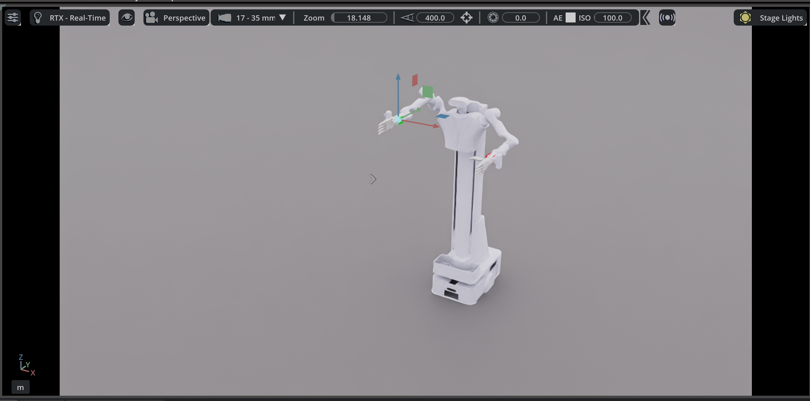

# Realman-Robot-IK-Control


## Project Overview
Realman-Robot-IK-Control is a control system for the Realman dual-arm robot, focusing on inverse kinematics (IK) solutions. This project integrates modules for robotic arms supporting both single-arm and dual-arm operations.

## Features
**Robotic Arm Module**:
   - Supports 7/6 degrees of freedom robotic arm motion control.
   - Provides inverse kinematics solutions.

## Code Structure
```
DigitTwin/
├── Assets/                # Resources including robot models and configuration files
├── Environment/           # Environment-related code
├── Kinematics/            # Kinematics solvers
├── Robot/                 # Robot control code
├── Utils/                 # Utility functions and resources
├── wuhan/                 # Additional resources
├── test.py                # Test script
├── requirements.txt       # Python dependencies
└── README.md              # Project documentation
```

## Requirements
- **Operating System**: Ubuntu 22.04
- **Dependencies**:
  - Python 3.8+
  - NVIDIA Isaac Sim 4.5.0
  - Libraries: Numpy, OmniKit, Termcolor, etc.

## Installation
1. Clone the repository:
   ```bash
   git clone https://github.com/your-repo/Realman-Robot-IK-Control.git
   cd Realman-Robot-IK-Control
   ```
2. Install dependencies:
   ```bash
   pip install -r requirements.txt
   ```

## Usage
1. Launch the simulation environment:
   ```bash
   python test.py
   ```
2. Control the robot:
   - Drag the target cuboid to control the robot's motion.

## File Descriptions
- **`Environment/Base_Env.py`**:
  - Defines the base class `BaseEnv` for simulation environment initialization, reset, and stepping.
- **`Kinematics/Kinematics_Solver.py`**:
  - Provides the inverse kinematics solver `RealmanKinematicsSolver` for left and right arm calculations.
- **`Robot/realman_robot.py`**:
  - Defines the robot control class `Realman` for joint control and pose setting.

## Contributing
Feel free to submit issues and pull requests to improve this project.

## License
This project is licensed under the [Apache License 2.0](Assets/realman/rm_models/LICENSE).
